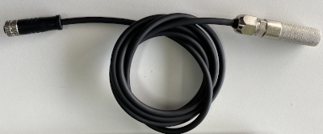

# sht3x-i2c Library

A library to interface a Particle device to an SHT31 temperature and humidity sensor using I2C

## Usage

The SHT31 has two modes that can be used for reading temperature and humidity:
* Single Shot: the Particle device will send a command to the sensor, wait for the measurement to complete, and then read the values.
* Periodic: the Particle device will set the sensor to continuously measure temperature and humidity, which will be available to read at any time.

### Which one should you use?

The Single Shot uses less power, as the sensor goes into idle mode while not measuring. However, the disadvantage is that getting a measurement takes longer since there is a wait time that is required between the command and the time the data is available to be retrieved.

In Periodic mode, data is available to be read immediately. However, this mode uses more power as the sensor is continuously making measurements.


## Tracker

Connect the TX/RX of the Asset Tracker SOM or the M8 connector on TrackerOne. Note that these pins are multiplexed between the UART and the Wire3 I2C port.

Some SHT31 boards already include pull-up resistors on SCL and SDA. If your board doesn't include them, make sure to connect 4.7k pull-up resostors on both I2C lines to 3.3V.

If using TrackerOne, the available power is 5V on CAN_5V pin. Since the I2C pins are not 5V tolerant, you will need to use a DC to DC converter to connect the power of the SHT31 sensor to 3.3V.

### Tracker ONE

When using the Particle accessory cable shown below, the 5V to 3.3V converter and pull-up resistors are included, so the hardware is ready to go.




See the example in `periodic/main.cpp` for how to retrieve the temperature and humidity and insert it into the location publish object. This will result in the values being stored in the database along with the location of the Tracker.

```
#include "Particle.h"

#include "tracker_config.h"
#include "tracker.h"
#include "sht3x-i2c.h"

SYSTEM_THREAD(ENABLED);
SYSTEM_MODE(SEMI_AUTOMATIC);

PRODUCT_ID(TRACKER_PRODUCT_ID);
PRODUCT_VERSION(TRACKER_PRODUCT_VERSION);

SerialLogHandler logHandler(115200, LOG_LEVEL_TRACE, {
    { "app.gps.nmea", LOG_LEVEL_INFO },
    { "app.gps.ubx",  LOG_LEVEL_INFO },
    { "ncp.at", LOG_LEVEL_INFO },
    { "net.ppp.client", LOG_LEVEL_INFO },
});

Sht3xi2c sensor(Wire3);

void loc_gen_cb(JSONWriter &writer, LocationPoint &point, const void *context)
{
    double temp, humid;

    if (sensor.get_reading(&temp, &humid) == 0)
    {
        writer.name("sh31_temp").value(temp);
        writer.name("sh31_humid").value(humid);
    }
}

void setup()
{
    Tracker::instance().init();
    Tracker::instance().location.regLocGenCallback(loc_gen_cb);
    
    pinMode(CAN_PWR, OUTPUT);       // Turn on 5V output on M8 connector
    digitalWrite(CAN_PWR, HIGH);    // Turn on 5V output on M8 connector
    delay(500);

    sensor.begin(CLOCK_SPEED_400KHZ);
    sensor.start_periodic();

    Particle.connect();
}

void loop()
{
    Tracker::instance().loop();
}
```

### Using Sleep modes

If you are using sleep modes to maximize battery life, you will want to shut things off when going to sleep, including the temperature and humidity sensor.

Create a callback to be executed before the Tracker goes to sleep, to turn the external power off:

```
void sleep_cb(TrackerSleepContext ctx)
{
    Log.info("putting application to sleep");
    digitalWrite(CAN_PWR,LOW);          
}
```

And a callback to be executed when the Tracker wakes up to turn the power back on:

```
void wake_cb(TrackerSleepContext ctx)
{
    digitalWrite(CAN_PWR,HIGH);
}
```

Register the callbacks by adding these two lines to `setup()`:

```
    TrackerSleep::instance().registerWake(wake_cb);
    TrackerSleep::instance().registerSleepPrepare(sleep_cb)
```

And last, make sure that you are not using periodic mode, but rather use the single shot measurement, since the sensor will be off most of the time. So, modify the location callback to be:

```
void loc_gen_cb(JSONWriter &writer, LocationPoint &point, const void *context)
{
    double temp, humid;

    if (sensor.single_shot(&temp, &humid) == 0)
    {
        writer.name("sh31_temp").value(temp);
        writer.name("sh31_humid").value(humid);
    }
}
```

and remove this line from `setup()`:

```
sensor.start_periodic();
```

## Boron/Argon

Connect the I2C bus of both devices (SCL and SDA), as well as 3.3V and GND. Some SHT31 boards already include pull-up resistors on SCL and SDA. If your board doesn't include them, make sure to connect 4.7k pull-up resistors on both I2C lines to 3.3V.

See the example in `single-shot.ino` for how to retrieve the temperature and humidity and print it to the serial port.

```
#include "Particle.h"
#include "sht3x-i2c.h"

SerialLogHandler logHandler(LOG_LEVEL_INFO);

Sht3xi2c sensor(Wire); 

void setup()
{
    sensor.begin(CLOCK_SPEED_400KHZ);
}

void loop()
{
    static uint32_t timer = System.uptime();
    double temp, humid;

    if (System.uptime() - timer > 5)
    {
        timer = System.uptime();
        if (sensor.single_shot(&temp, &humid) == 0)
        {
            Log.info("Temperature: %.2f, Humidity: %.2f", temp, humid);
        }
    }
}
```